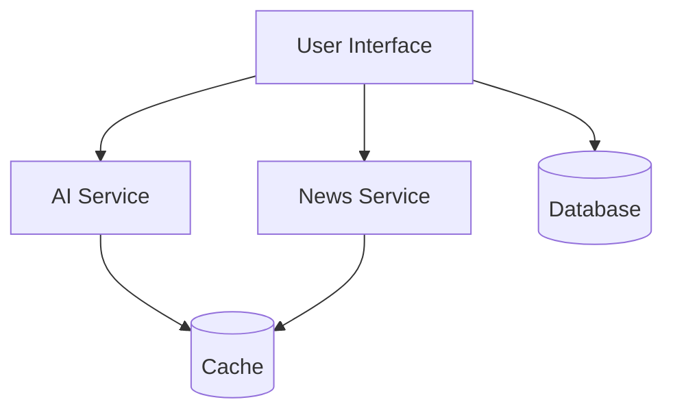
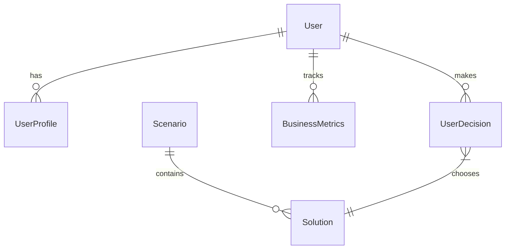
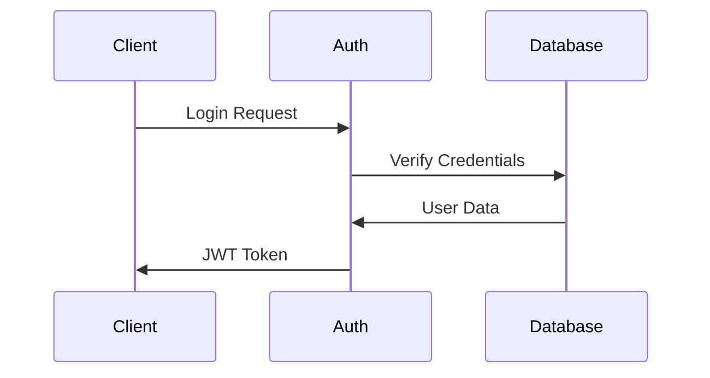
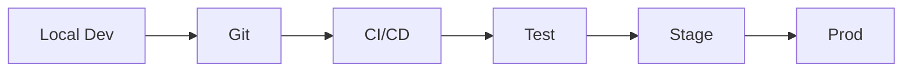

# BizSim Architecture Documentation

## System Overview

BizSim is a real-time business simulation platform built on a modern web stack. The system combines AI-driven scenario generation with real-time business metrics tracking and user decision analysis.



## Core Components

### 1. Frontend Architecture

#### Component Hierarchy
```
Dashboard
├── KPISection
│   └── KPICard
├── DepartmentSection
│   └── DepartmentSlider
├── ScenarioSection
│   └── SolutionCards
└── NewsTicker
```

#### State Management
- Local component state for UI interactions
- React Context for global state
- Optimistic updates for real-time feedback

### 2. Backend Services

#### AI Service Layer
```typescript
interface AIService {
  generateScenario(context: BusinessContext): Promise<Scenario>
  analyzeSolution(solution: Solution): Promise<Impact>
  getSpecialProjectsRecommendation(context: BusinessContext): Promise<Solution>
}
```

#### News Service Layer
```typescript
interface NewsService {
  getLatestNews(): Promise<NewsItem[]>
  filterByRelevance(news: NewsItem[]): NewsItem[]
  updateNewsStream(callback: (news: NewsItem) => void): void
}
```

### 3. Database Architecture

#### Entity Relationship Diagram


#### Key Tables
- Users & Authentication
- Business Metrics & KPIs
- Scenarios & Solutions
- Historical Decisions

### 4. Real-time Updates

#### WebSocket Implementation
```typescript
interface WebSocketService {
  connect(): void
  subscribeToMetrics(callback: (metrics: Metrics) => void): void
  subscribeToNews(callback: (news: NewsItem) => void): void
  unsubscribe(topic: string): void
}
```

## Technical Decisions

### 1. Framework Selection

#### Next.js 14
- **Pros**:
  - Server-side rendering
  - API routes
  - TypeScript support
  - File-based routing
- **Cons**:
  - Learning curve
  - Build complexity
  - Deployment considerations

### 2. Database Choice

#### PostgreSQL
- **Pros**:
  - ACID compliance
  - JSON support
  - Complex queries
  - Prisma integration
- **Cons**:
  - Setup complexity
  - Resource usage
  - Scaling considerations

### 3. AI Integration

#### Google Gemini
- **Pros**:
  - Advanced language model
  - Structured output
  - Context awareness
- **Cons**:
  - Cost considerations
  - Rate limiting
  - Response time variability

## Performance Optimizations

### 1. Caching Strategy

#### Client-side Cache
```typescript
interface CacheConfig {
  maxAge: number
  staleWhileRevalidate: boolean
  cachePriority: 'high' | 'low'
}
```

#### Server-side Cache
- Redis for session data
- Memory cache for AI responses
- Database query cache

### 2. Loading States

#### Progressive Loading
```typescript
interface LoadingState {
  isLoading: boolean
  progress: number
  stage: 'initial' | 'data' | 'complete'
}
```

## Security Architecture

### 1. Authentication Flow



### 2. API Security

#### Rate Limiting
```typescript
interface RateLimitConfig {
  windowMs: number
  max: number
  keyGenerator: (req: Request) => string
}
```

#### Input Validation
- JSON Schema validation
- TypeScript type checking
- Runtime type checking
- XSS protection

## Deployment Architecture

### 1. Development Environment


### 2. Production Environment
- Container orchestration
- Load balancing
- Auto-scaling
- Health monitoring

## Error Handling

### 1. Error Types
```typescript
type ErrorType = 
  | 'ValidationError'
  | 'NetworkError'
  | 'AIError'
  | 'DatabaseError'
  | 'AuthenticationError'
```

### 2. Error Recovery
- Retry mechanisms
- Fallback states
- User feedback
- Error logging

## Monitoring and Logging

### 1. Metrics Collection
- Performance metrics
- User interactions
- Error rates
- API response times

### 2. Logging Strategy
- Structured logging
- Log levels
- Log aggregation
- Alert thresholds

## Future Considerations

### 1. Scaling Strategy
- Horizontal scaling
- Database sharding
- Caching layers
- Load balancing

### 2. Feature Extensions
- Machine learning integration
- Advanced analytics
- Real-world data integration
- Mobile application

## Development Guidelines

### 1. Code Organization
- Feature-based structure
- Shared utilities
- Type definitions
- Service abstractions

### 2. Testing Strategy
- Unit tests
- Integration tests
- E2E tests
- Performance testing

## Conclusion

This architecture provides a robust foundation for the BizSim platform while maintaining flexibility for future enhancements and scale. Regular reviews and updates to this document should be performed as the system evolves.
