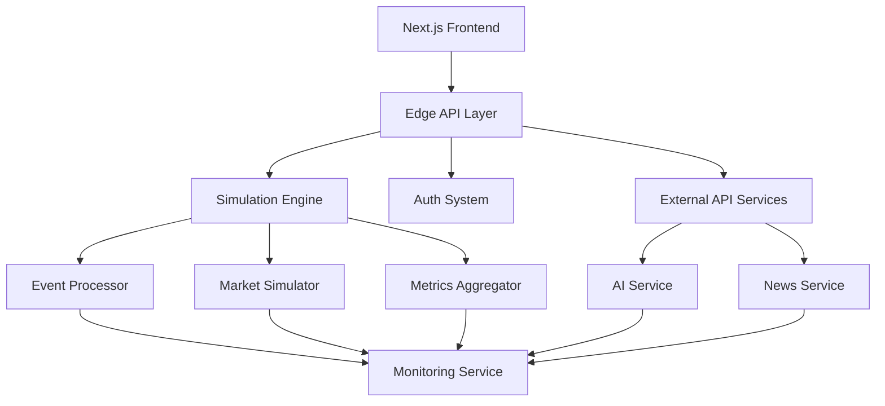

# QwikBiz Architecture Overview

## System Architecture

## Core Components

### Frontend Layer
- Next.js 14 App Router
- Edge Runtime compatible
- Atomic Design Pattern
- Real-time updates
- Performance optimized

### API Layer
- Edge API Routes
- JWT Authentication
- Rate Limiting
- Input Validation
- Monitoring Integration

### External API Services
- Development/Production modes
- Mock data support
- Error recovery
- Performance monitoring
- Configurable timeouts

### Simulation Engine
- Event Processing (11M events/sec)
- Market Dynamics
- Department Networks
- Performance Metrics
- Real-time Analysis

### Authentication System
- JWT with Refresh Tokens
- Edge-compatible Auth
- Session Management
- Role-based Access
- Security Monitoring

### Monitoring System
- Real-time Metrics
- Alert Conditions
- Performance Tracking
- Error Aggregation
- System Health

## Key Characteristics

### Performance
- Edge Computing
- Memory Optimization
- Event Processing
- Response Times
- Resource Usage

### Security
- Zero Trust Model
- JWT Security
- Input Sanitization
- Rate Protection
- Audit Logging

### Scalability
- Horizontal Scaling
- Edge Distribution
- Resource Management
- Load Balancing
- Cache Strategy

### Monitoring
- Real-time Metrics
- Alert System
- Performance Data
- Error Tracking
- Business KPIs

## Data Flow

### User Interactions
1. UI Component Event
2. API Request (Edge)
3. Authentication Check
4. Business Logic
5. Real-time Update

### External API Workflow
1. Service Request
2. Configuration Check
3. Mode Selection (Dev/Prod)
4. API Call/Mock Data
5. Error Handling
6. Monitoring Update

### Simulation Flow
1. Event Generation
2. Processing Pipeline
3. Market Impact
4. Metrics Update
5. State Propagation

### Monitoring Flow
1. Metric Collection
2. Aggregation
3. Alert Processing
4. Dashboard Update
5. Log Storage

## System Boundaries

### Frontend Boundary
- UI Components
- State Management
- User Interactions
- Real-time Updates
- Error Handling

### API Boundary
- Request Handling
- Authentication
- Validation
- Rate Limiting
- Response Format

### External Services Boundary
- API Configuration
- Mode Management
- Mock Data
- Error Recovery
- Performance Tracking

### Simulation Boundary
- Event Processing
- Market Logic
- Department Logic
- Metrics Processing
- State Management

## Integration Points

### External Services
- AI Service (Gemini API)
- News Service (NewsAPI)
- Authentication Providers
- Analytics Services
- Monitoring Systems

### Internal Services
- Event System
- Metrics System
- Auth System
- Market System
- Monitor System

## Performance Characteristics

### Response Times
- API: < 200ms
- UI Render: < 100ms
- Event Process: < 50ms
- Data Updates: < 150ms
- Alert Trigger: < 100ms

### Throughput
- 11M events/second
- 1000 concurrent users
- 5000 market updates/sec
- 2000 metrics/sec
- 100 alerts/min

### Resource Usage
- Memory: Optimized
- CPU: Efficient
- Network: Minimal
- Storage: Compact
- Cache: Strategic

## Security Model

### Authentication
- JWT Based
- Refresh Tokens
- Session Management
- Role System
- Access Control

### Data Protection
- Encryption
- Sanitization
- Validation
- Audit Logs
- Rate Limits

## Monitoring Strategy

### Metrics
- System Health
- Performance
- Business KPIs
- User Actions
- Error Rates

### Alerts
- Thresholds
- Conditions
- Responses
- Escalation
- Resolution

## Development Workflow

### Code Organization
- Feature Modules
- Clean Architecture
- Clear Boundaries
- Type Safety
- Documentation

### Testing Strategy
- Unit Tests
- Integration
- Performance
- Security
- E2E

## Deployment Model

### Infrastructure
- Edge Network
- Global Distribution
- Auto-scaling
- High Availability
- Disaster Recovery

### Release Process
- CI/CD Pipeline
- Automated Tests
- Performance Checks
- Security Scans
- Rollback Plan

## Future Considerations

### Scalability
- Multi-region
- Load Distribution
- Resource Scaling
- Cache Strategy
- Database Sharding

### Features
- AI Enhancement
- Analytics Pipeline
- Real-time Collaboration
- Advanced Scenarios
- Custom Metrics

### Technical Debt
- Code Optimization
- Test Coverage
- Documentation
- Performance
- Security Hardening
