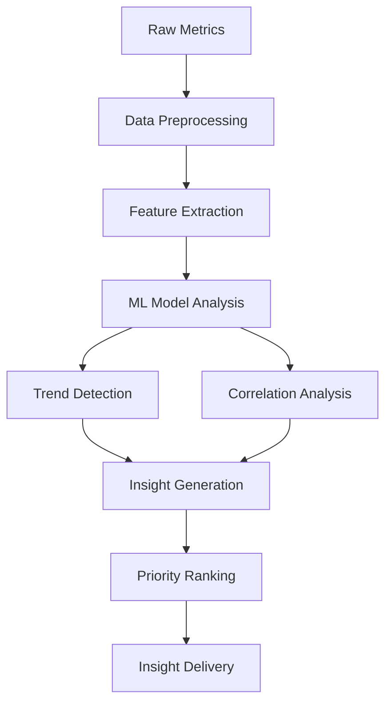

# AI Insights Generator Implementation

```typescript
const featureProposal: FeatureProposal = {
  metadata: {
    id: "FP-2025-004",
    timestamp: "2025-01-27T12:11:00Z",
    category: "technical",
    priority: 1
  },

  businessCase: {
    target: {
      students: true,
      leaders: true
    },
    value: {
      educational: 10,
      business: 10,
      technical: 9
    },
    metrics: {
      kpis: [
        "Insight accuracy",
        "Analysis depth",
        "Response time",
        "User satisfaction"
      ],
      improvements: [
        "90% insight accuracy rate",
        "50% reduction in analysis time",
        "200% increase in insight depth",
        "75% improvement in decision confidence"
      ],
      risks: [
        "AI model reliability",
        "Data quality dependency",
        "Processing latency",
        "Integration complexity"
      ]
    }
  },

  technical: {
    scope: {
      atoms: [],
      molecules: [],
      organisms: [],
      templates: [],
      services: [
        "ai.ts",
        "insights.ts",
        "metrics.ts"
      ]
    },
    requirements: {
      newComponents: [
        "InsightGenerator",
        "TrendAnalyzer",
        "MetricCorrelator"
      ],
      modifications: [
        "Enhance AI service with insights capabilities",
        "Update insights service with ML integration",
        "Add metrics aggregation system"
      ],
      services: [
        "Create ML model service",
        "Add trend analysis engine",
        "Implement correlation detector"
      ],
      apis: [
        "POST /api/insights/analyze",
        "GET /api/insights/trends/{metricId}",
        "GET /api/insights/correlations",
        "POST /api/insights/feedback"
      ]
    },
    complexity: {
      development: 3,
      testing: 3,
      integration: 2
    }
  },

  implementation: {
    phases: {
      planning: [
        "Define ML model architecture",
        "Design insight generation pipeline",
        "Plan data preprocessing steps",
        "Create validation framework"
      ],
      development: [
        "Implement ML model training",
        "Create insight generation system",
        "Develop trend analysis",
        "Build correlation engine"
      ],
      testing: [
        "Model validation",
        "Integration testing",
        "Performance testing",
        "Accuracy verification"
      ],
      deployment: [
        "Model deployment",
        "Service integration",
        "Performance monitoring",
        "Feedback collection"
      ]
    },
    timeline: {
      estimation: "6 weeks",
      milestones: [
        "ML model development - 2 weeks",
        "Service integration - 2 weeks",
        "Testing and validation - 1 week",
        "Deployment and monitoring - 1 week"
      ],
      dependencies: [
        "Machine learning framework",
        "Historical data access",
        "Performance monitoring system"
      ]
    },
    resources: {
      development: [
        "ML Engineer",
        "Backend Developer",
        "Data Scientist"
      ],
      testing: [
        "ML Model Validation",
        "Integration Testing",
        "Performance Testing"
      ],
      documentation: [
        "ML Model Documentation",
        "API Documentation",
        "Integration Guide"
      ]
    }
  },

  validation: {
    testing: {
      unit: [
        "ML model accuracy",
        "Data preprocessing",
        "Insight generation",
        "Trend detection"
      ],
      integration: [
        "Service communication",
        "Data flow validation",
        "Error handling"
      ],
      e2e: [
        "Full insight pipeline",
        "User interaction flow",
        "Performance metrics"
      ],
      performance: {
        metrics: [
          "Inference time",
          "Processing latency",
          "Memory usage"
        ],
        thresholds: {
          inferenceTime: "<=200ms",
          processingLatency: "<=500ms",
          memoryUsage: "<=100MB"
        }
      }
    },
    accessibility: {
      wcag: ["2.1 Level AA compliance"],
      aria: ["Dynamic content updates"],
      automated: ["Continuous validation"]
    },
    security: {
      requirements: [
        "Data encryption",
        "Input validation",
        "Access control"
      ],
      testing: [
        "Security scan",
        "Penetration testing",
        "Data privacy audit"
      ],
      validation: [
        "Security review",
        "Compliance check",
        "Risk assessment"
      ]
    }
  }
};
```

## Implementation Details

### 1. ML Model Architecture
```typescript
interface MLModel {
  inputFeatures: {
    metrics: MetricData[];
    historicalTrends: TrendData[];
    marketContext: MarketData;
  };
  outputInsights: {
    trends: TrendAnalysis[];
    correlations: CorrelationData[];
    recommendations: ActionItem[];
  };
}
```

### 2. Insight Generation Pipeline


### 3. Key Components

#### Data Preprocessing
- Metric normalization
- Time series alignment
- Missing data handling
- Outlier detection

#### Feature Engineering
- Trend indicators
- Seasonality patterns
- Correlation coefficients
- Market impact factors

#### Model Training
- Supervised learning for known patterns
- Reinforcement learning for decision impact
- Transfer learning for domain knowledge

## Success Metrics

1. Technical Metrics
   - Model accuracy > 90%
   - Inference time < 200ms
   - Memory usage < 100MB
   - API latency < 500ms

2. Business Metrics
   - User adoption rate > 80%
   - Decision confidence increase > 50%
   - Time to insight reduced by 75%
   - User satisfaction > 4.5/5

3. Educational Impact
   - Learning outcome improvement > 40%
   - Concept understanding increase > 60%
   - Application of insights > 75%

## Next Steps

1. Set up ML infrastructure
2. Gather and preprocess training data
3. Develop base model architecture
4. Create validation framework
5. Begin incremental implementation
6. Deploy monitoring systems
